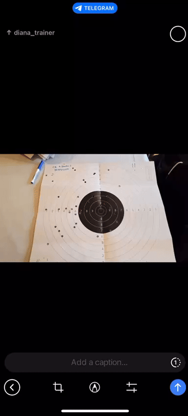

# YOLOv5 Target Detection Telegram Bot Project

This project utilizes a YOLOv5 model to detect shooting targets (referred to as "dianas") via a Telegram bot. The repository includes two main scripts with different functionalities:

- **`bot_dianas.py`**: Receives images, runs detection using YOLOv5, and calculates a score based on target accuracy.
- **`bot_dianas_train.py`**: Allows image confirmation and adds confirmed images to the training dataset, with an option to retrain the YOLOv5 model.




## Prerequisites

- **Python 3.8+**
- **YOLOv5** and its dependencies
- **Telegram API Bot Token**
- **CUDA-enabled GPU** (recommended for training)

## Installation

### 1. Clone the YOLOv5 Repository

Clone the official YOLOv5 repository to access the model and utilities:

```bash
git clone https://github.com/ultralytics/yolov5
cd yolov5
```

### 2. Install Dependencies

Install required Python packages:

```bash
pip install -r requirements.txt
```

Install additional packages such as OpenCV and Matplotlib:

```bash
pip install opencv-python matplotlib
```

If you have a GPU, install PyTorch with CUDA support:

```bash
pip install torch torchvision torchaudio --index-url https://download.pytorch.org/whl/cu118
```

### 3. Set Up Telegram Bot

Get your bot token from [BotFather](https://t.me/BotFather) on Telegram, and replace the `token` variable in both scripts with your token.

## Scripts

### 1. `bot_dianas.py` – YOLOv5 Detection and Scoring

This script processes images received via Telegram, runs them through YOLOv5, and returns a score based on the position of the detected targets.

#### Features:

- **Image Input**: Receives and processes images sent by users.
- **YOLOv5 Inference**: Detects targets using YOLOv5.
- **Scoring**: Calculates and returns the score based on the proximity of the detected holes to the target's center.

#### How to Use:

1. Send an image to the Telegram bot.
2. The bot processes the image and sends back the detected target with a score.

### 2. `bot_dianas_train.py` – Confirming Detections and Retraining

This script adds functionality for the user to confirm detections. If confirmed, images are added to the training dataset, and the YOLOv5 model can be retrained.

#### Features:

- **Detection and Confirmation**: Detects targets and allows users to confirm the result.
- **Training Dataset Management**: Adds confirmed images and annotations to the training dataset.
- **Model Retraining**: Optionally retrains the YOLOv5 model with the newly confirmed data.

#### How to Use:

1. Send an image to the Telegram bot.
2. Confirm the detection result.
3. If confirmed, the image is added to the training set for retraining.

## YOLOv5 Commands

To perform detection, the following command is called within the script:

```bash
python ../yolov5/detect.py --source ./image.jpg --weights ../yolov5/best.pt --img 640 --hide-labels --exist-ok --project ../outputs --line-thickness 1 --save-txt
```

For retraining, the command may look like this:

```bash
python ../yolov5/train.py --data ../yolov5/train_data/custom_data.yaml --weights ../yolov5/best.pt --epochs 300 --batch-size 16 --img-size 640
```

Adjust paths and parameters according to your environment.
